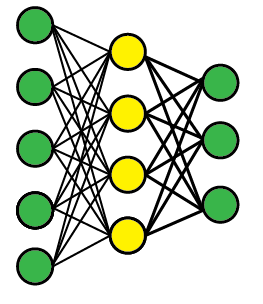

[](https://classroom.github.com/open-in-codespaces?assignment_repo_id=17935232)
# A2. Image Classifier Application
Train a model using the Teachable Machine and create a new application that uses that model.

## The final submission will include:

1. A pre-trained model from [Teachable Machine](https://teachablemachine.withgoogle.com)
2. A custom application built using p5.js and HTML using that model
3. Instructions on the app page describing how to use it
4. A brief report showing what you used to train it and other observations you may have.
    - Replace this file (`README.md`) with your report.
    - Here's a cheat [sheet for markdown](https://github.com/adam-p/markdown-here/wiki/Markdown-Cheatsheet)

## Details

* You will train the Teachable Machine model to do something of your design. 
* Either create or find a data set of images to use as training and test data.
* Model should have at least THREE classes.
* You don't need to deal with the code in this repo until the model is done in TM!

Be creative! Let the process guide you. Pivot as needed as you dive in and understand more. 

You can use any HTML and p5.js stuff to make your app. You can make a custom interface, add buttons, or whatever! 

## Some helpful resources:

* Documentation on [ml5 imageClassifier](https://ml5js.org/reference/api-ImageClassifier/)
* TONS of pre-made data sets if you want to use them: https://paperswithcode.com/datasets
* Even more data sets (which might need a little more work to import) can be found on [kaggle](https://www.kaggle.com/datasets?tags=14102-Image+Data)

## How to Work on it and Submit

1. Use the online VSCode editor (press the period key)
2. Install recommended plugins from the plugins menu on the left side of the VSCode window:
        * Five Server plugin (you can click "Go Live" in the lower right corner of VSCode to launch the server)
        * LTeX: a spell checker! A nice feature to have. Understands the markdown files. Use command-. over the word to engage it.
3. Use the "Go Live" button in the lower right corner to run your code.
4. Commit your changes using git. Push the changes when you're done, using the "Sync Changes" button.


## Details

* Work will be primarily, if not entirely, in the `sketch.js` file.
* You will need to pre-train a model using Teachable Machine, and import it into your project. This can be done two ways:
    1. "Upload" it so you get a teachable machine link.
    2. "Download" it as a zip, which you can unzip into the project directory.
* Whether you import with 1 or 2, you'll need to change line 15 of `sketch.js` to reflect where the model is, either the link or the directory.
    ```
    15| let imageModelURL = 'https://teachablemachine.withgoogle.com/models/bXy2kDNi/';
    ```
* Other important places to edit will be the following functions:
    * `setup` - same as 1101, sets up your UI and whatever else you'll need
    * `draw` - whatever needs to be updated on the screen
    * `gotResult` - gets called when the classifier finishes processing a frame. Is passed the argument `results`, an array of all the classes in order of confidence. Use this however you want!
* Of course, you can edit anything else, too!

## Don't forget

* The browser console is where errors will be displayed. Check there first if something isn't working right! (control + shift + i on most browsers. Command + shift + i on Mac.)
* The `preload()` function actually loads the model, which is done to prevent to rest of the program from starting before it is ready. `preload()` also displays "Loading..." in the browser while the model loads, so you know it's working!
* You can edit this file as much as you want, and I'll see it. It is written using Markdown formatting. 
* You can add images and other files into this folder and commit them to git. You can then make those images appear on this page using Markdown. Here's an example:

